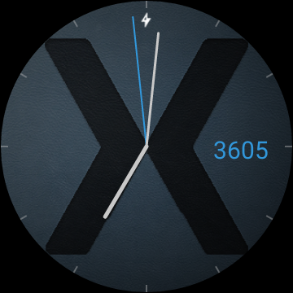

# Android Wear & Google Fit Minihack

In this Minihack, you will learn how to write an Android Wear Watchface that displays your up to date step count. The user will be able to turn the step counter on and off via a configuration activity both on their watch and the connected phone.

We will cover the following APIs:

- Android Wear:
	- Watchface API
	- Configuration Activities
	- DataLayer APIs
- Google Fit 
	- Recording API

The Minihack is divided into N challenges with increasing complexity. If you finish all challenges, you're elligible to enter a drawing for a grand prize (one of thirty Android Wear Smartwatches - Fossil Q Founder, powered by and sponsored by Intel).

# Challenge 1: Build a Simple Android Wear watchface

Use the Xamarin solution `XfitFace.sln` in the `challenge1` folder as a starting point for this challenge. It contains the skeleton code for an analog watchface. Your task is to finish the implementation and run the watchface on the connected watch.

## Tasks

1. Run the watchface on the connected watch.
2. Make sure the watchface actually displays ticks and hour marks.
3. Hide the digital time display.

## Walkthrough

1. Open the solution. Select the name of a connected watch from the target dropdown menu, and press the *Run* button.
2. After deployment has finished, the text "I'm round. Tap me!" will appear on the watch display. This is just the main activity contained in the wearable project. Swipe right to dismiss the activity. Longpress the display to invoke the watchface switcher, and swipe right until you see `XFit Watchface`. Tap to select the watchface. After a little while, a digital display of the time will appear.

3. To actually display the analog watch face, add the following two lines to the `OnDraw` method:

		DrawFace(canvas, bounds);
		DrawHands(canvas, bounds);
		
4. To get rid of the digital time display, change the following lines in `OnCreate`:

		SetWatchFaceStyle(new WatchFaceStyle.Builder(owner)
			.SetCardPeekMode(WatchFaceStyle.PeekModeShort)
			.SetBackgroundVisibility(WatchFaceStyle.BackgroundVisibilityInterruptive)
			.SetShowSystemUiTime(true)
			.Build()
			);
			
	to:

		SetWatchFaceStyle(new WatchFaceStyle.Builder(owner)
			.SetCardPeekMode(WatchFaceStyle.PeekModeShort)
			.SetBackgroundVisibility(WatchFaceStyle.BackgroundVisibilityInterruptive)
			.SetShowSystemUiTime(false)
			.Build()
			);
			
Congrats! You just wrote your first Android Wear watchface using C#!

# Challenge 2: Add a Step Count Display
For displaying the user's step count, we first need to add a text display to the watch face. To get the step count, we need to connect to Google Fit using a `GoogleApiClient` and then read the current step count.

## Tasks

1. Finish the implementation of the method `GetTotalSteps()` in `XFitWatchfaceServiceStepCount.cs` to get the daily step count from Google Fit. Here is the equivalent Java code (*note that the C# implementation will be much more concise*):

		PendingResult<DailyTotalResult> result = HistoryApi.readDailyTotal(client, TYPE_STEP_COUNT_DELTA);
		DailyTotalResult totalResult = result.await(30, SECONDS);
		if (totalResult.getStatus().isSuccess()) {
			DataSet totalSet = totalResult.getTotal();
			long total = totalSet.isEmpty() 
				? 0
				: totalSet.getDataPoints().get(0).getValue(FIELD_STEPS).asInt();
		} else {
			// handle failure
		}
		
	**Hint**: make use of the provided methods `int ExtractStepValue(Bucket bucket)` and `int ExtractStepValue(DataSet dataSet)`
2. Finish implementing `DrawStepCount` to display the step count at the 3 o'clock position on the watch face.

## Walkthrough

1. In `GetTotalSteps()`, replace the comment with the following code:

		// Handy tip: ReadDailyTotal doesn't require user permission
		var result = await FitnessClass.HistoryApi.ReadDailyTotalAsync(googleApiClient, Android.Gms.Fitness.Data.DataType.TypeStepCountDelta);
		var ds = result.Total;
		stepCount = ExtractStepValue(ds);

2. In `DrawStepCount`, replace the comment with the following code to draw the step count at 3 o'clock:

		var width = bounds.Width();
		var height = bounds.Height();

		var steps = stepCount.ToString();
		var stepsWidth = stepcountPaint.MeasureText(steps);

		var x = width - stepsWidth - owner.Resources.GetDimension(Resource.Dimension.StepCountOffset);
		var y = (height + owner.Resources.GetDimension(Resource.Dimension.StepCountTextSize)) / 2.0f;

		canvas.DrawText(steps, x, y, stepcountPaint);

# Challenge 3: Add a Wearable Config Activity
Android Wear allows users to configure certain aspects of watch faces via configuration activities. In this challenge, you'll create a config activity to toggle the visibility of the step count display.

The source code for this challenge can be found in the folder `challenge3`.

## Tasks
1. Make sure to save the visibility of the step count display when the user toggles its state in the configuration activity. *Hint: there are some useful helper methods in `XFitWatchfaceConfigHelper.cs`* 
2. Connect the config activity to the watchface service. The [Android Wear documentation explains](http://developer.android.com/training/wearables/watch-faces/configuration.html) which metadata attributes you need to add to the manifest to do so. *Hint: the [Xamarin documentation explains](https://developer.xamarin.com/guides/android/advanced_topics/working_with_androidmanifest.xml/) how to add metadata attributes directly to C# classes.*

## Walkthrough
1. In the `OnCreate` method found in `XFitWatchfaceWearableConfigActivity`, replace the comment with the following line to save the step count visibility:

		XFitWatchfaceConfigHelper.SaveStepCountStatus(googleApiClient, !state);
		
2. To connect the config activity to the watchface service, add the following line just before the class declaration in `XFitWatchfaceServiceConfig.cs`:

		[MetaData("com.google.android.wearable.watchface.wearableConfigurationAction", Value = "XFitWatchface.CONFIG")]
		
# Challenge 4: Implement a Companion Config Activity
In this challenge, you will implement an configuration activity that allows you to configure the watch face from inside the Android Wear companion app on your phone.

### Tasks
1. Make sure to save the step count display visibility when the user toggles its state in the configuration activity. *Hint: again, there are some useful helper methods in `XFitWatchfaceConfigHelper.cs`* 
2. Connect the config activity to the watchface service. To do this, you need to add a metadata attribute on the **watch face implementation**.

### Walkthrough
1. In the `OnCreate` method found in `XFitWatchfaceCompanionConfigActivity`, replace the comment with the following line to save the step count visibility:

		XFitWatchfaceConfigHelper.SaveStepCountStatus(googleApiClient, checkbox.Checked);

2. To connect the config activity to the watchface service, add the following line just before the class declaration in `XFitWatchfaceServiceConfig.cs`:

		[MetaData("com.google.android.wearable.watchface.companionConfigurationAction", Value = "XFitWatchface.CONFIG")]

# Finish
In this code lab, you've learned how to

* implement an analog watch face
* run the watch face on a physical device
* connect to Google Fit and fetch step count data
* display a step count display on the watch face
* synchronize data between multiple nodes in a wearable network using the Android Wear DataLayer API
* implement a configuration activity

Now go and show off your watch face! Extra bonus points for changing the colors of the hands and using a custom background image :-)