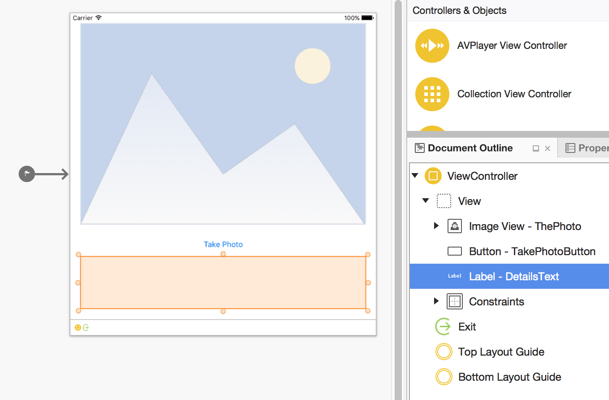

##### Create a Xamarin.iOS project in Visual Studio 2015 and Xamarin or Xamarin Studio setup

1. With Visual Studio 2015 or Xamarin Studio, create a new project with the iOS > Single View App template.

2. Add the following Nuget package to your project:
    * Microsoft.ProjectOxford.Emotion

##### Design the UI layer

The UI should be composed of an UIImageView, a UILabel and a UIButton. Open up Main.storyboard and lay them out similar to:



Name the label "DetailsText", the button "TakePhotoButton", and the image view "ThePhoto".

Set the UIImageView View > Mode to Aspect Fit or the image will be distorted.

You may need to set the ViewAs to your specific phone or add constraints for everything to show on screen. 

Feel free to ask the person running the mini-hack for assistence if needed.

##### Get the camera stream, take a picture and send the stream to the shared code

 The logic behind the UI is quite simple.  
 The button TouchDown is bound to OnTakePhotoPressed, which invokes UIImagePickerController to snap the photo.
 The image is copied to a memory stream, displayed on teh UI, and then sent to the business logic.
 
 Replace the ```ViewController``` class with the following code:

```csharp
protected ViewController (IntPtr handle) : base (handle)
{
	// Note: this .ctor should not contain any initialization logic.
}
	
public override void ViewDidAppear (bool animated)
{
	TakePhotoButton.TouchDown += OnTakePhotoPressed;
}

void OnTakePhotoPressed (object sender, EventArgs eventArgs)
{
	TakePhotoButton.Enabled = false;

	UIImagePickerController picker = new UIImagePickerController ();
	picker.SourceType = UIImagePickerControllerSourceType.Camera;

	picker.FinishedPickingMedia += async (o, e) => {
		// Create a moderate quality version of the image
		byte [] dataBytes;
		using (NSData data = e.OriginalImage.AsJPEG (.5f)) {
			dataBytes = new byte [data.Length];
			System.Runtime.InteropServices.Marshal.Copy (data.Bytes, dataBytes, 0, Convert.ToInt32 (data.Length));
		}

		ThePhoto.Image = e.OriginalImage;
		DetailsText.Text = "Processing...";

		((UIImagePickerController)o).DismissViewController (true, null);

		// Create a stream, send it to MCS, and get back 
		using (MemoryStream stream = new MemoryStream (dataBytes)) {
			try {
				float happyValue = await SharedProject.Core.GetAverageHappinessScore (stream);
				DetailsText.Text = SharedProject.Core.GetHappinessMessage (happyValue);
			} catch (Exception ex) {
				DetailsText.Text = ex.Message;
			}
			TakePhotoButton.Enabled = true;

		}
	};
	PresentModalViewController (picker, true);
}
```

Be sure to have the following using statements:

```csharp
using System;
using System.IO;
using Foundation;
using UIKit;
```
If you build your project, you should have an issue with the usage of "Core", which does not exist yet. This will be the next step.


##### Create a shared project with the logic to call the Cognitive Service API

Create a new project in your solution, with the Templates > Visual C# > Shared Project template. Use a name like "SharedProject".

Create a new class in the project, with the name "Core".

Copy/Paste the following code, by replacing the placeholder with your Emotion API key. This method is calling the Emotion API, through the SDK you've referenced thanks to the Microsoft.ProjectOxford.Emotion Nuget package.

```csharp
private static async Task<Emotion[]> GetHappiness(Stream stream)
{
    string emotionKey = "YourKeyHere";

    EmotionServiceClient emotionClient = new EmotionServiceClient(emotionKey);

    var emotionResults = await emotionClient.RecognizeAsync(stream);

    if (emotionResults == null || emotionResults.Count() == 0)
    {
        throw new Exception("Can't detect face");
    }

    return emotionResults;
}
```

Copy/Paste the following code in the Core class, which are utilities method to do some calculation and some formating on the API results:

```csharp
//Average happiness calculation in case of multiple people
public static async Task<float> GetAverageHappinessScore(Stream stream)
{
    Emotion[] emotionResults = await GetHappiness(stream);

    float score = 0;
    foreach (var emotionResult in emotionResults)
    {
        score = score + emotionResult.Scores.Happiness;
    }

    return score / emotionResults.Count();
}

public static string GetHappinessMessage(float score)
{
    score = score * 100;
    double result = Math.Round(score, 2);

    if (score >= 50)
        return result + " % :-)";
    else
        return result + "% :-(";
}
```

Be sure to use the following using statements in the Core class:

```csharp
using Microsoft.ProjectOxford.Emotion;
using Microsoft.ProjectOxford.Emotion.Contract;
using System;
using System.IO;
using System.Linq;
using System.Threading.Tasks;
```

You can now add a reference to your SharedProject project from you iOS app, by using the wizard available after a right clicking on the "References" node in the Solution Explorer. One section of this wizard is a listing of all the Shared Projects available in your solution.

##### Build and run the project

Build the solution and run the project on device (there is no webcam access from the iOS emulator. 

By clicking on the "Take a picture" button, you should launch the webcam capture. Validating the capture will send the picture to the API and display the result on the screen.
